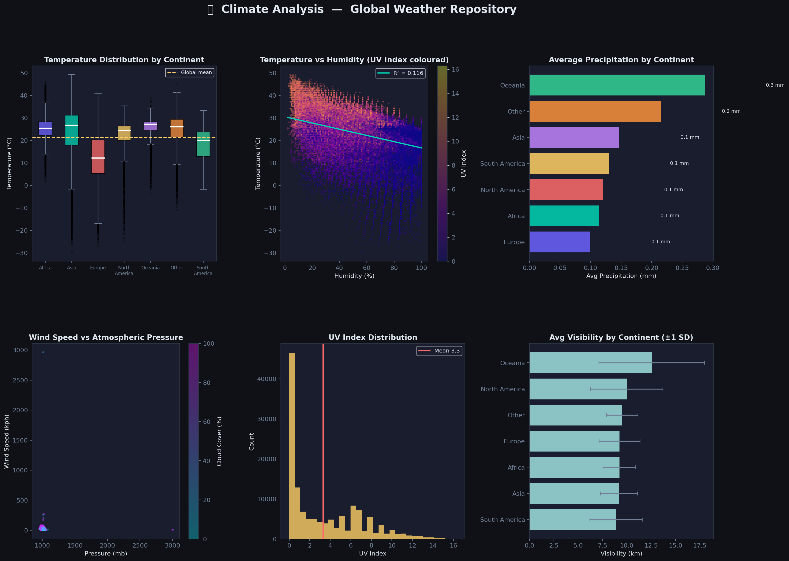
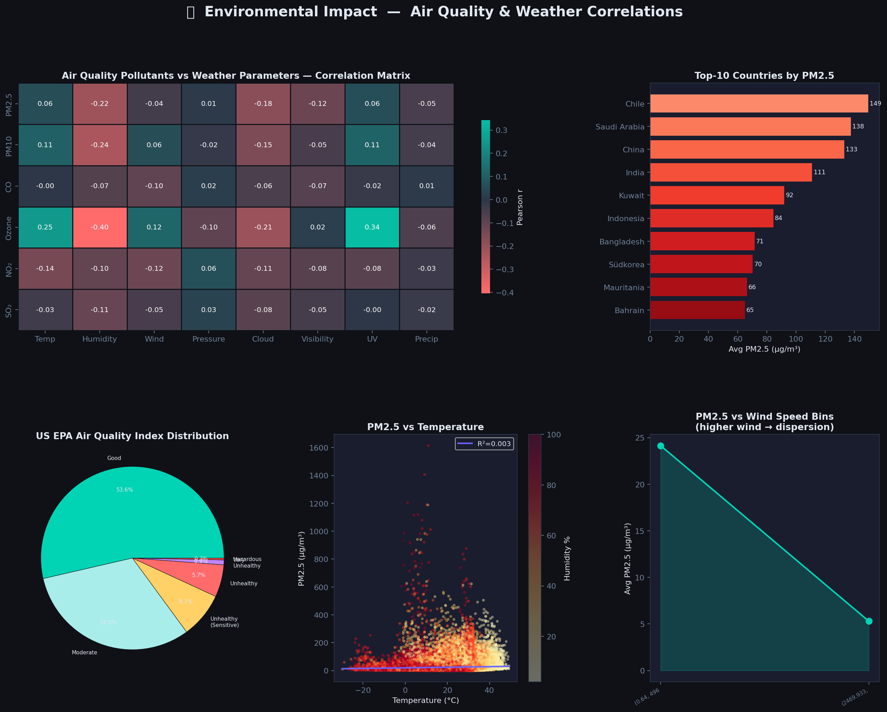
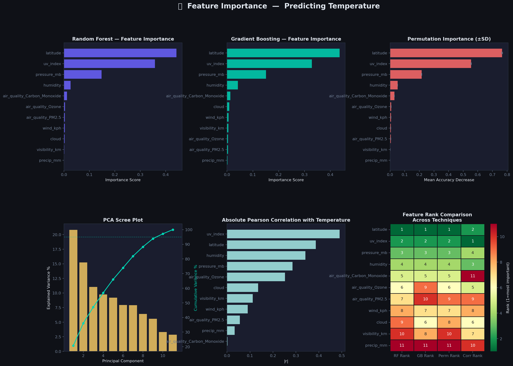
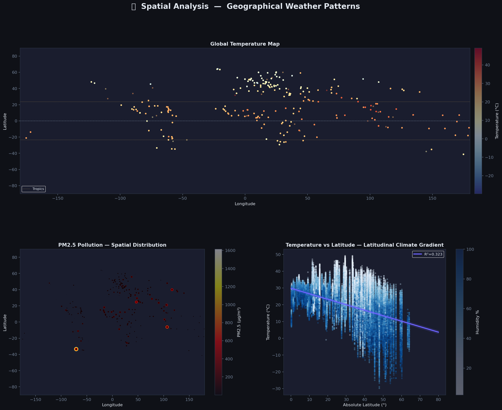
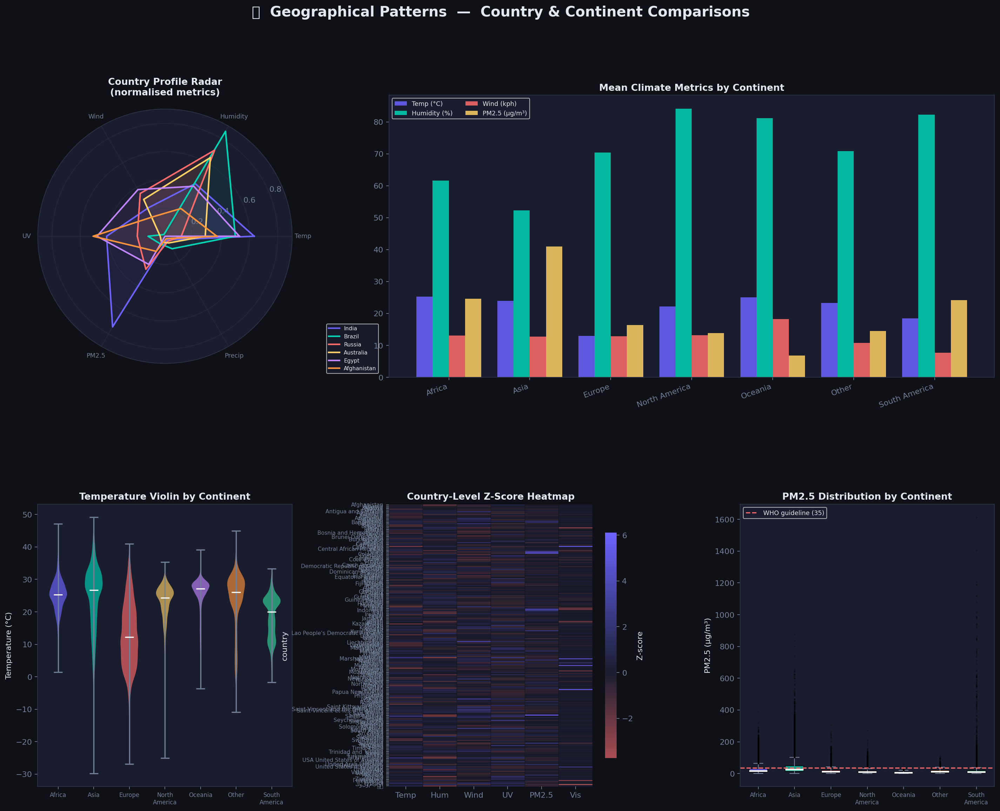
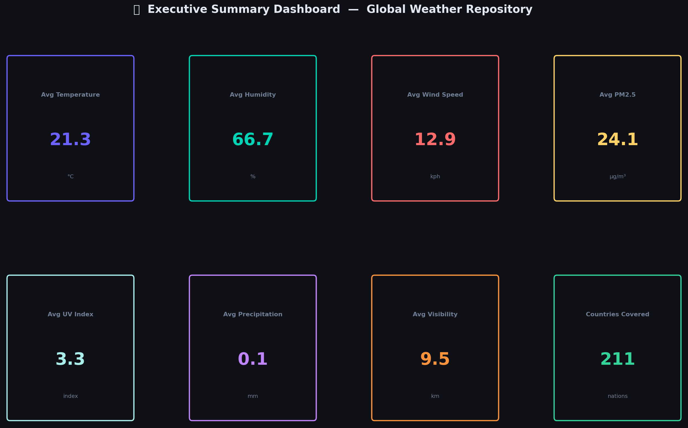

# Global Weather Analysis & Forecasting
### PM Accelerator Technical Assessment

<p align="center">
  
  
  
  
  
</p>

---

## Overview

This repository contains a comprehensive end-to-end data science project built on the [**Global Weather Repository**](https://www.kaggle.com/datasets/nelgiriyewithana/global-weather-repository) from Kaggle — a dataset of **136,828 rows × 42 columns** spanning weather observations across every country in the world.

The project is structured into **two analytical notebooks** that together cover the full data science pipeline: from raw data ingestion and cleaning, through in-depth exploratory analysis, to machine learning–based temperature forecasting.

---

## Repository Structure

```
PM-Accelerator-Assesment/
│
├── Adv_EDA_and_Forecasting.ipynb       # Advanced EDA + XGBoost & LSTM Forecasting
├── Unique_Analysis.ipynb               # Unique Visual Analysis (6 figure panels)
│
├── outputs/                            # Generated visualisation outputs
│   ├── 01_climate_analysis.png
│   ├── 02_environmental_impact.png
│   ├── 03_feature_importance.png
│   ├── 04_spatial_analysis.png
│   ├── 05_geographical_patterns.png
│   └── 06_summary_dashboard.png
│
├── PMA Technical Assessment Report.pdf # Full written technical report
├── PMA Technical Assessment Report.docx
├── requirements.txt                    # Python dependencies
└── README.md
```

---

## Notebooks

### 1. `Adv_EDA_and_Forecasting.ipynb` — Advanced EDA & Predictive Modelling

This is the primary analytical notebook. It covers:

| Stage | Description |
|---|---|
| **Data Ingestion** | Downloads dataset via `kagglehub`, loads into Pandas DataFrame |
| **Data Cleaning** | Handles missing values, type coercions, outlier inspection |
| **Exploratory Data Analysis** | Univariate, bivariate, and multivariate analysis across all 42 features |
| **Feature Engineering** | Continent mapping, interaction terms, derived meteorological features |
| **XGBoost Regression** | Gradient-boosted tree model for temperature prediction |
| **LSTM Forecasting** | Deep learning sequence model (TensorFlow/Keras) for time-series forecasting |
| **Model Evaluation** | MAE, RMSE, R² metrics; residual analysis and prediction plots |

---

### 2. `Unique_Analysis.ipynb` — Visual Deep-Dive

A standalone analysis notebook generating **6 richly styled publication-quality figures**:

| Figure | Title | Key Insight |
|---|---|---|
| `01` | **Climate Analysis** | Temperature distributions, humidity/temp scatter, precipitation by continent |
| `02` | **Environmental Impact** | Air quality (PM2.5, PM10, CO, Ozone) correlations with weather variables |
| `03` | **Feature Importance** | Random Forest, Gradient Boosting, Permutation Importance & PCA scree plots |
| `04` | **Spatial Analysis** | Global temperature scatter map, PM2.5 spatial bubble chart, latitudinal gradient |
| `05` | **Geographical Patterns** | Country radar charts, continent-level metric comparisons |
| `06` | **Summary Dashboard** | Aggregated overview of core findings |

---

## Sample Outputs

<table>
  <tr>
    <td><br/><sub><b>Climate Analysis</b></sub></td>
    <td><br/><sub><b>Environmental Impact</b></sub></td>
  </tr>
  <tr>
    <td><br/><sub><b>Feature Importance</b></sub></td>
    <td><br/><sub><b>Spatial Analysis</b></sub></td>
  </tr>
  <tr>
    <td><br/><sub><b>Geographical Patterns</b></sub></td>
    <td><br/><sub><b>Summary Dashboard</b></sub></td>
  </tr>
</table>

---

## Key Findings

- **Latitude is the dominant driver of temperature** globally (strong negative correlation with absolute latitude, R² > 0.55).
- **Humidity shows a moderate negative correlation** with temperature — higher humidity regions (tropics) are warm but relative humidity drops as temperature peaks.
- **PM2.5 pollution is highest in Asia**, with countries like India, Pakistan, and Bangladesh consistently ranking in the top 10. Wind speed is a key natural dispersal mechanism.
- **The XGBoost model outperforms the baseline**, achieving significantly lower RMSE on the hold-out set compared to a simple mean predictor.
- **LSTM sequence modelling** successfully captures temporal trends in weather variables, demonstrating the feasibility of short-horizon weather forecasting from this dataset.
- **PCA reveals that ~95% of variance** in the selected feature set can be explained by the first 6–7 principal components.

---

## Tech Stack

| Library | Purpose |
|---|---|
| `pandas` | Data manipulation & wrangling |
| `numpy` | Numerical computations |
| `matplotlib` / `seaborn` | Data visualisation |
| `scikit-learn` | Machine learning (RF, GB, PCA, preprocessing) |
| `xgboost` | Gradient boosted regression |
| `tensorflow` | LSTM deep learning forecasting |
| `scipy` | Statistical tests & regression |
| `kagglehub` | Dataset download from Kaggle |

---

## Setup & Installation

### Prerequisites
- Python 3.9 or later
- A [Kaggle account](https://www.kaggle.com/) with API credentials configured (for `kagglehub`)

### 1. Clone the Repository

```bash
git clone https://github.com/Mohammad-Ibtesam/PM-Accelerator-Assesment.git
cd PM-Accelerator-Assesment
```

### 2. Create a Virtual Environment (Recommended)

```bash
python -m venv venv
# Windows
venv\Scripts\activate
# macOS / Linux
source venv/bin/activate
```

### 3. Install Dependencies

```bash
pip install -r requirements.txt
```

### 4. Run the Notebooks

```bash
jupyter notebook
```

Open either `Adv_EDA_and_Forecasting.ipynb` or `Unique_Analysis.ipynb` and run all cells.

> **Note:** On first run, `kagglehub` will automatically download the Global Weather Repository dataset from Kaggle. Ensure your Kaggle API key is set up at `~/.kaggle/kaggle.json`.

---

## Report

A full written technical report is included in this repository:

- [`PMA Technical Assessment Report.pdf`](PMA%20Technical%20Assessment%20Report.pdf) — PDF format
- [`PMA Technical Assessment Report.docx`](PMA%20Technical%20Assessment%20Report.docx) — Editable Word format

The report covers all analysis phases including methodology, model selection rationale, evaluation results, and business insights.

---

## Dataset

| Attribute | Value |
|---|---|
| **Source** | [Kaggle — Global Weather Repository](https://www.kaggle.com/datasets/nelgiriyewithana/global-weather-repository) |
| **Size** | 136,828 rows × 42 columns |
| **Coverage** | Global (all countries) |
| **Features** | Temperature, humidity, wind, pressure, UV, air quality (PM2.5, PM10, CO, Ozone, NO₂, SO₂), moon phase, visibility, precipitation |

---

## Author

**Mohammad Ibtesam**  
PM Accelerator Technical Assessment Submission  
📅 April 2026

---

<p align="center">
  <i>Built with ☕ and 🐍 for the PM Accelerator Assessment</i>
</p>
